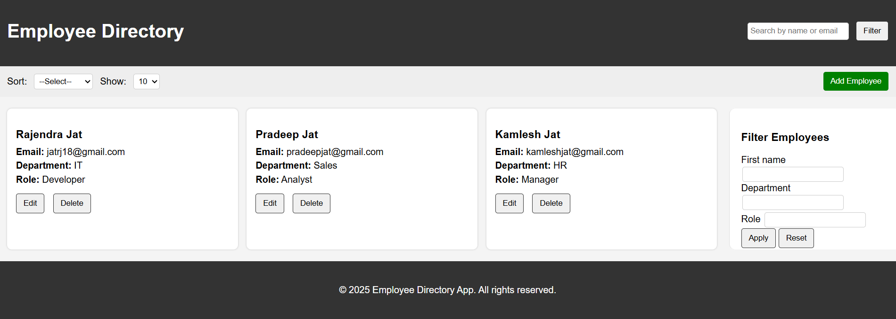
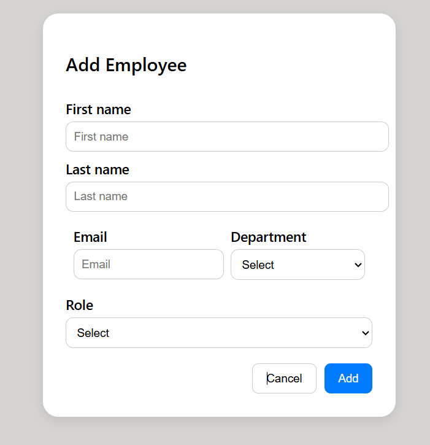

# 👨‍💼 Employee Directory Web App

This is a responsive and interactive **Employee Directory** built with **HTML**, **CSS**, and **Vanilla JavaScript**. It allows users to view, add, edit, delete, filter, sort, and search employee records using mock data stored in the browser's `localStorage`.

---

## 📌 Features

- 🔍 Search employees by name or email
- 🎯 Filter by first name, department, and role
- 🔃 Sort by first name or department
- 🧮 Show per page: 10 / 25 / 50
- ➕ Add new employee
- ✏️ Edit employee info
- ❌ Delete employee
- ✅ Responsive design (Desktop / Tablet / Mobile)
- ⚡ Works entirely on the frontend (no backend required)

---

## 🏗️ Project Structure

### employee-directory/

```
├── index.html # Main dashboard with employee cards
├── form.html # Add/Edit employee form (reused for both add & edit)
├── data.js # Initial mock employee data (inserted into localStorage)

├── css/
│ └── style.css # All global styling and layout (including responsive design)
│ └── form.css # Dedicated styles for form UI (based on screenshot design)

├── js/
│ └── script.js # Logic for listing, filtering, searching, sorting, deleting
│ └── form.js # Handles form validation, saving and editing employee data
```

---

## 🚀 How to Run This App

### 1️⃣ Clone or Download

```bash
git clone https://github.com/rajendra-jat7/EMPLOYEE_DIRECTORY.git
cd employee-directory

```

---

## 📸 Screenshots

### 💼 Dashboard Page



### ➕ Add Employee Form



---

## 🤔 Reflection

### ✅ What Went Well

- Clean, modular code structure using pure HTML, CSS, and JavaScript
- Employee data managed efficiently using `localStorage` for persistent mock data
- UI was carefully recreated to match design references with attention to detail
- No external libraries used — demonstrating full control over the DOM, styling, Responsiveness and logic

### 🚧 Challenges Faced

- Managing both **add** and **edit** flows within the same form page while preserving form state
- Designing modular filter, sort, and pagination logic while keeping the code maintainable
- Ensuring responsive behavior on various screen sizes using only custom CSS and media queries

### 💡 If I Had More Time

- Implement numbered pagination or infinite scroll for better large dataset handling
- Add inline form field validation hints (e.g., real-time error messages for email or required fields)
- Include employee profile images or auto-generated avatars on each card
- Convert the separate form page into a modal popup for a smoother user experience
- Add export (CSV/JSON) and import functionality for saving/restoring employee data

### 📦 Project Learnings

This project helped reinforce my understanding of building a complete, interactive UI without frameworks. It improved my skills in DOM manipulation, real-time validation, modular JavaScript logic, and maintaining clean code. I also practiced thinking from a user experience (UX) perspective while keeping the code lightweight and maintainable.

---

## 👤 Author

### Rajendra Jat

**Frontend Developer**

---

### 📝 Notes:

- Replace `https://github.com/rajendra-jat7/EMPLOYEE_DIRECTORY.git` with your GitHub link (if pushing this).
- If you're submitting screenshots in a folder, create `screenshots/` and place your image files with names like `dashboard.png`, `form.png`.

---

Let me know if you'd like me to generate or compress those screenshots for submission. ✅
